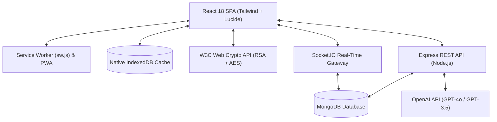

# VakSetu — Real-Time AI-Powered & End-to-End Encrypted Messenger

A production-grade, full-stack MERN real-time messaging platform equipped with **Client-Side End-to-End Encryption (E2EE)**, **OpenAI Assistant integration & AI Smart Tools**, **Voice Notes with dynamic waveforms**, **PWA offline support**, and a **Zero-Dependency Native IndexedDB caching layer**.

---

## 🌟 Key Highlights

- **🔒 Zero-Knowledge End-to-End Encryption (E2EE)**:
  - Built on the native W3C **Web Crypto API** (`RSA-OAEP 2048-bit` for key exchange + `AES-GCM 256-bit` for payload authenticated encryption).
  - Private keys never leave the browser (`localStorage`). Plaintext messages never touch server memory or database.
  - 60-digit commutative **Safety Number fingerprints** for in-person contact verification.
- **🤖 Native AI Assistant & Smart Tools**:
  - SSE real-time streaming OpenAI responses with markdown formatting.
  - One-click message tone rewriter (**Professional, Casual, Concise, Fix Grammar**).
  - Multi-language translation across 10+ languages.
  - Conversation summarization into executive bullet points.
  - Contextual AI smart replies.
- **🎙️ Voice Messages with Live Waveforms**:
  - Web Audio API `AnalyserNode` live audio frequency equalizer during recording.
  - Custom HTML5 canvas waveform visualizer with seekable playback, play/pause controls, and duration display.
- **⚡ Offline-First PWA with IndexedDB**:
  - Service Worker (`sw.js`) with cache-first static asset caching and network-first navigation fallback.
  - Native browser `window.indexedDB` caching conversations and messages for instant launch with zero skeleton screen lag.
  - Offline message outbox queue with animated status indicator, automatically synchronizing upon reconnection.
- **📂 Rich Shared Media Gallery & Message Actions**:
  - Organized tabs for Media (images/videos), Documents, Voice notes, and extracted Links.
  - Multi-pin banner carousel with smooth click-to-jump navigation.
  - User-specific starred messages with dedicated sidebar filter.
  - In-line message editing, reactions, forwarding, and batch deletion.
- **♿ Full Accessibility (a11y) & Keyboard Navigation**:
  - Compliant ARIA dialog roles (`role="dialog"`, `aria-modal="true"`, `aria-labelledby`).
  - `Escape` key dismissal across all modals and inputs.
  - `Enter` to send, `Shift+Enter` for multi-line drafting.

---

## 🏗️ System Architecture



---

## 🛠️ Technology Stack

| Layer | Technologies |
| :--- | :--- |
| **Frontend UI** | React 18, Tailwind CSS, Lucide Icons, Pure JSX (Zero TypeScript) |
| **Animation & Rendering** | Framer Motion, React Markdown, Canvas Waveform Visualizer |
| **Cryptography** | Native W3C Web Crypto API (`RSA-OAEP 2048-bit`, `AES-GCM 256-bit`, SHA-256) |
| **Client Storage** | Native `window.indexedDB` (`aichatbot_offline_cache` v1), `localStorage` |
| **PWA & Offline** | Web App Manifest (`manifest.json`), Custom Service Worker (`sw.js`) |
| **Backend API** | Node.js (ES Modules), Express.js 4, Helmet, Express Rate Limit, CORS |
| **Real-Time Communication** | Socket.IO 4 (WebSockets with polling fallback), Room Multiplexing |
| **Database & ODM** | MongoDB 6+, Mongoose 8 (Indexes, Compound Keys, Population) |
| **File Storage** | Multer (25MB limits, mime-type verification) |
| **Artificial Intelligence** | OpenAI Node SDK, Server-Sent Events (SSE) Chunk Streaming |

---

## 📋 Complete 20-Step Implementation Roadmap

- [x] **Step 1: Project Setup & Monorepo Structure** — Node.js ES modules, React 18, Tailwind, MongoDB configuration.
- [x] **Step 2: Authentication & JWT** — User model, bcrypt hashing, JWT issuance, protected middleware.
- [x] **Step 3: User Profiles & Privacy** — Status, bio, avatar, read receipts, online/last seen privacy controls.
- [x] **Step 4: Real-Time UI Shell** — Responsive three-column layout, mobile drawers, dark/light theme.
- [x] **Step 5: Chat Models & REST API** — 1-on-1 conversations, unread counters, message endpoints.
- [x] **Step 6: Socket.IO Real-Time Engine** — Bi-directional event gateway, room joins, instant dispatch.
- [x] **Step 7: Presence, Typing & Seen Receipts** — Online status tracking, debounce typing, read receipts.
- [x] **Step 8: Message Actions & Interaction** — Reactions, editing, reply threading, single & batch deletion.
- [x] **Step 9: Rich File Uploads** — Multer 25MB handling, image previews, lightbox modal, file cards.
- [x] **Step 10: Group Chats & Role Management** — Multi-user groups, member promotion, admin permissions.
- [x] **Step 11: Global & In-Chat Search** — Regex search across conversations, users, in-chat hit navigation.
- [x] **Step 12: In-App & Browser Notifications** — Sound alerts, unread badges, Web Notification API.
- [x] **Step 13: OpenAI Assistant Integration** — SSE streaming AI assistant, chat markdown rendering.
- [x] **Step 14: AI Smart Tools (Rewriter, Summarizer)** — Tone rewriting, conversation summarization.
- [x] **Step 15: AI Translation & Smart Replies** — 10+ language translation, context-aware reply chips.
- [x] **Step 16: Voice Messages & Audio Waveforms** — Web Audio API recording, equalizer, waveform player.
- [x] **Step 17: Message Pinning, Starring & Media Gallery** — Multi-pin carousel, starred tab, 4-bucket media gallery.
- [x] **Step 18: End-to-End Encryption (E2EE)** — Web Crypto API, zero-knowledge DB, Safety Number fingerprints.
- [x] **Step 19: IndexedDB Offline Caching & PWA Support** — Service Worker, PWA manifest, outbox sync queue.
- [x] **Step 20: Comprehensive E2E Testing & Production Polish** — Master E2E runner, a11y compliance, production docs.

---

## 🚀 Getting Started

### Prerequisites
- **Node.js**: `v18.0.0` or newer (`v20+` / `v24+` recommended)
- **MongoDB**: Local MongoDB instance running on `localhost:27017` or MongoDB Atlas URI
- **OpenAI API Key**: Optional (fallback mock streaming activates if not provided)

### 1. Environment Configuration

Create `server/.env`:
```env
PORT=5000
NODE_ENV=development
MONGODB_URI=mongodb://localhost:27017/aichatbot
JWT_SECRET=your_super_secret_jwt_key_at_least_32_characters_long
JWT_EXPIRES_IN=7d
OPENAI_API_KEY=your_openai_api_key_here
CLIENT_URL=http://localhost:5173
```

Create `client/.env`:
```env
VITE_API_URL=http://localhost:5000
VITE_SOCKET_URL=http://localhost:5000
```

### 2. Installation

```bash
# Install backend dependencies
cd server
npm install

# Install frontend dependencies
cd ../client
npm install
```

### 3. Running Development Servers

```bash
# Terminal 1: Start Backend Server
cd server
npm run dev

# Terminal 2: Start Frontend Client
cd client
npm run dev
```

Open your browser at `http://localhost:5173`.

---

## 🧪 Comprehensive Automated Test Suites

The repository contains automated test suites covering every milestone:

```bash
cd server

# Master Unified End-to-End Test (Steps 1 through 20)
npm run test:e2e

# Milestone Tests
npm run test:user             # Step 2: User model & bcrypt validation
npm run test:auth             # Step 2: Authentication & JWT issuance
npm run test:models           # Step 5: Conversation & Message models
npm run test:chat-api         # Step 5: REST Chat Endpoints
npm run test:socket           # Step 6: Socket.IO real-time message exchange
npm run test:presence         # Step 7: Presence, typing indicators & read receipts
npm run test:message-actions  # Step 8: Reactions, edits & soft deletion
npm run test:upload           # Step 9: Multer uploads & attachment metadata
npm run test:groups           # Step 10: Group chats & admin permissions
npm run test:search           # Step 11: Global search & in-chat search
npm run test:notifications    # Step 12: In-app notifications
npm run test:ai               # Step 13: OpenAI SSE assistant stream
npm run test:ai-tools         # Step 14-15: Rewriter, translation & smart replies
npm run test:voice            # Step 16: Voice message durations & audio waveforms
npm run test:step17           # Step 17: Pinning banner, starred tab & media gallery
npm run test:step18           # Step 18: End-to-End Encryption & zero-knowledge DB
npm run test:step19           # Step 19: PWA manifest, service worker & IndexedDB outbox
```

---

## 📡 REST API & WebSocket Reference

### Key REST Endpoints

| Method | Endpoint | Description | Auth |
| :--- | :--- | :--- | :--- |
| `POST` | `/api/auth/register` | Register new user | Public |
| `POST` | `/api/auth/login` | Login user & issue JWT | Public |
| `GET` | `/api/auth/me` | Fetch authenticated user profile | Private |
| `PUT` | `/api/auth/me` | Update profile, bio, status, privacy | Private |
| `PUT` | `/api/users/public-key` | Register user RSA-OAEP public key | Private |
| `GET` | `/api/users/:id/public-key` | Fetch contact's public key | Private |
| `GET` | `/api/conversations` | List user conversations & unread counts | Private |
| `POST` | `/api/conversations` | Create or get 1-on-1 conversation | Private |
| `POST` | `/api/groups` | Create group chat | Private |
| `GET` | `/api/messages/:convId` | Paginated messages for conversation | Private |
| `POST` | `/api/messages` | Send message (plaintext or E2EE payload) | Private |
| `PUT` | `/api/messages/:id/pin` | Toggle message pinned state | Private |
| `POST` | `/api/messages/:id/star` | Toggle user starred message bookmark | Private |
| `GET` | `/api/messages/starred` | List user starred messages across chats | Private |
| `GET` | `/api/messages/media/:id` | Categorized Shared Media Gallery | Private |
| `POST` | `/api/ai/stream` | Server-Sent Events AI assistant streaming | Private |
| `POST` | `/api/ai/rewrite` | Rewrite draft into selected tone | Private |
| `POST` | `/api/ai/translate` | Translate text into target language | Private |
| `GET` | `/api/search` | Global search across messages & contacts | Private |

### WebSocket Events (Socket.IO)

| Event | Direction | Payload |
| :--- | :--- | :--- |
| `join_conversation` | Client ➔ Server | `conversationId` |
| `leave_conversation` | Client ➔ Server | `conversationId` |
| `send_message` | Client ➔ Server | `{ conversationId, text, isEncrypted, ciphertext, iv, encryptedKeys, ... }` |
| `new_message` | Server ➔ Client | Full populated `message` object |
| `typing_start` / `typing_stop`| Client ➔ Server | `{ conversationId }` |
| `user_typing` | Server ➔ Client | `{ conversationId, userId, username, name }` |
| `mark_messages_read` | Client ➔ Server | `{ conversationId }` |
| `messages_read` | Server ➔ Client | `{ conversationId, readBy, readAt }` |
| `message_pinned` | Server ➔ Client | `{ messageId, conversationId, pinned, pinnedBy }` |
| `user_status` | Server ➔ Client | `{ userId, isOnline, lastSeen }` |

---

## 🚢 Production Deployment

### 1. Build Client
```bash
cd client
npm run build
```
Generates optimized chunks in `client/dist` (`index`, `vendor-react`, `vendor-motion`, `vendor-network`, `vendor-icons`), Service Worker `sw.js`, and PWA `manifest.json`.

### 2. Start Production Server
```bash
cd server
NODE_ENV=production npm start
```

---

## 📄 License
ISC License. Built with ❤️ for pairing high-performance real-time communication with zero-knowledge cryptography.
